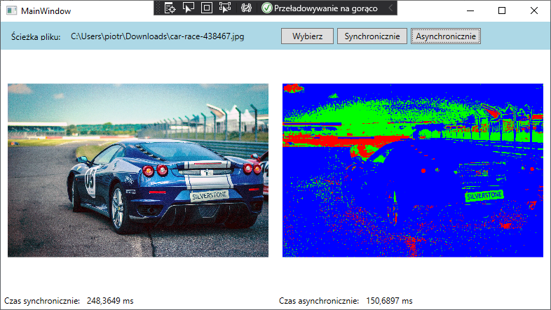

# ImageProcessing
Simple image processing app created with WPF

### 512x512 image to rgb colors

### 512 x 512 sobel operator(edge detection)

### 512 x 512 grayscale

### 5016 x 3344 image to rgb colors

